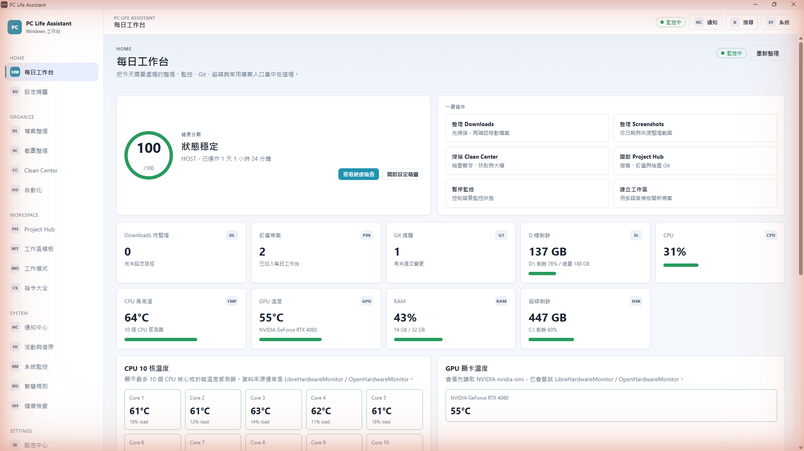
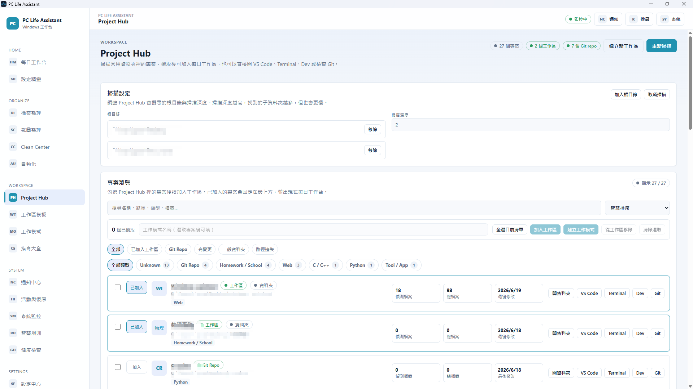
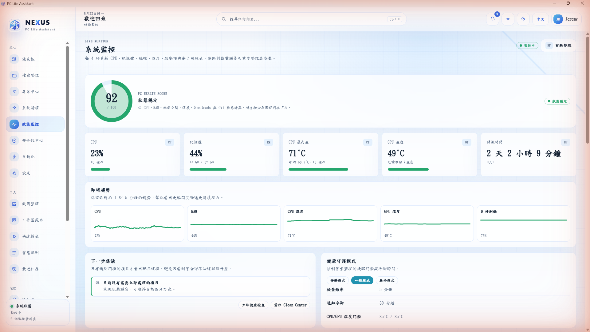
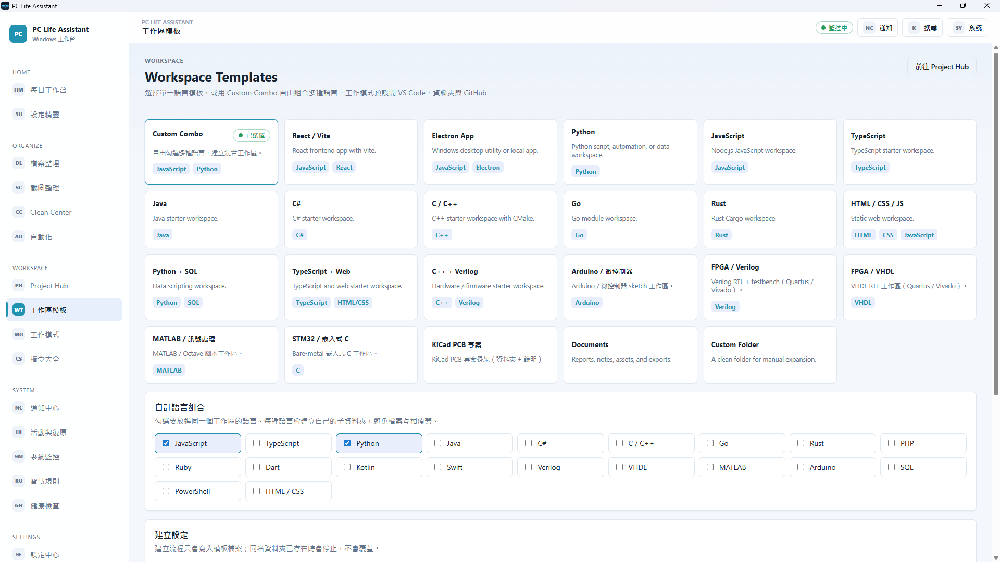
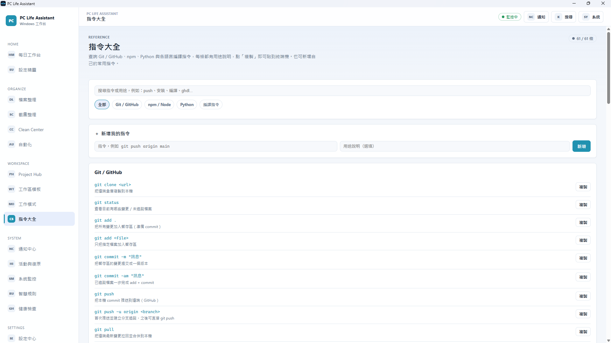
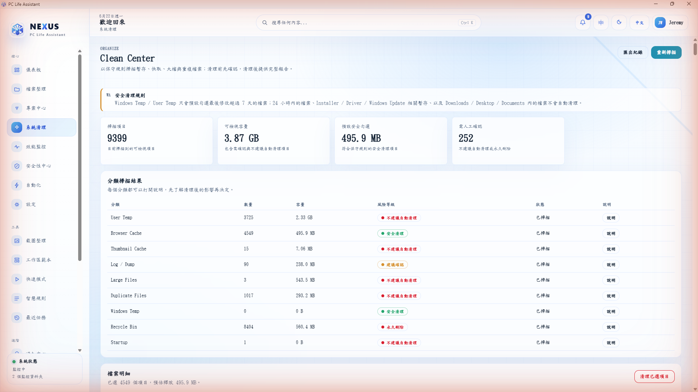
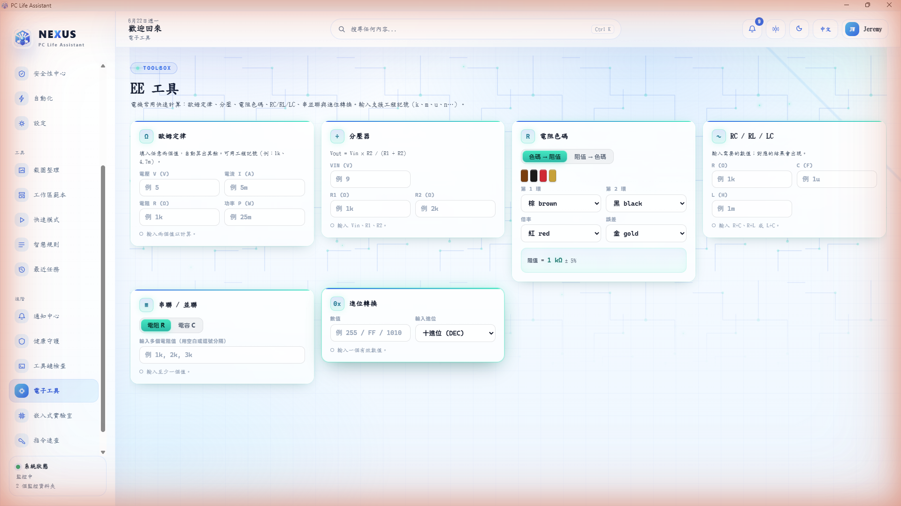
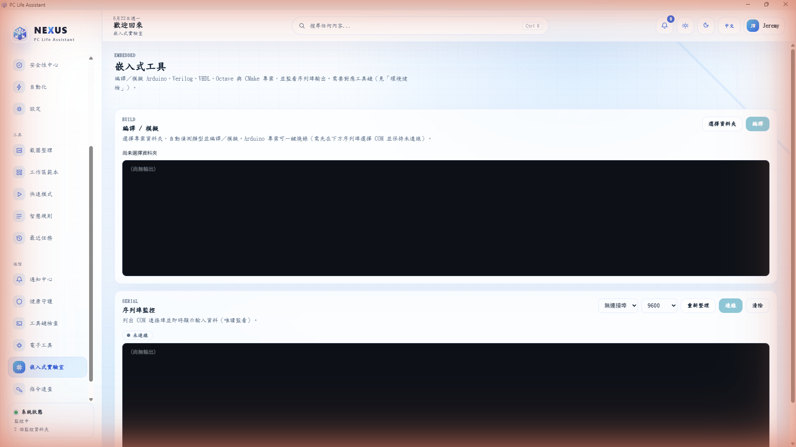

<div align="center">

# 🖥️ PC Life Assistant

**A Windows desktop workspace assistant for students, engineers, and makers.**

One place to launch projects, organize files, monitor system health, and keep daily development workflows tidy — without replacing your task manager or IDE.

[](https://github.com/jeremywu0420/windows-assistant/actions/workflows/ci.yml)
[](https://github.com/jeremywu0420/windows-assistant/releases)
[](#requirements)
[](https://www.electronjs.org/)
[](https://react.dev/)
[](https://vitejs.dev/)
[](#license)

</div>

<div align="center">
  
  <br/>
  <sub><b>Dashboard</b> · An interactive 3D live-nodes globe surrounded by key metrics — PC health score, live system overview (CPU / RAM / disk / network), cleanup state, and recent activity.</sub>
</div>

---

## ✨ Overview

PC Life Assistant combines a daily workspace dashboard, project launcher, file organizer, system health monitor, automation rules, safe cleanup tools, a Windows Security overview, and a gaming-style performance overlay into a single Electron app. The interface is branded **NEXUS** in-app and is fully **bilingual (English / 繁體中文)** with a language switch in Settings.

The goal is not to be another todo list — it's to **remove the small repeated steps** around everyday computer work: opening the same folders and tools, sorting the Downloads folder, keeping an eye on disk space and temperatures, and remembering which projects still need a Git commit.

- 🔒 **Review-first & safe by design** — file actions preview before moving, never auto-delete, and Git & Security features are read-only.
- 🧩 **No account, no cloud, no database** — every setting lives in a local JSON file.
- 🛡️ **No admin rights required** — works entirely within the folders you configure.

> The screenshots in this README are captured from the live app. The interface ships **bilingual (English / Traditional Chinese)** with an in-app language switch in Settings; the captures below show the Traditional Chinese interface, with English captions under each image.

---

## 🚀 Key Features

| Area                     | What it does                                                                                                                                                                                                                                                                                   |
| ------------------------ | ---------------------------------------------------------------------------------------------------------------------------------------------------------------------------------------------------------------------------------------------------------------------------------------------- |
| **Dashboard**            | Redesigned home view with an interactive 3D "live nodes" globe (Three.js), health score, live system overview (CPU / RAM / disk / network), cleanup state, and recent activity.                                                                                                                |
| **Project Hub**          | Scans your project roots, classifies projects by type, detects Git repos, filters and pins, and turns selected projects into a reusable Work Mode.                                                                                                                                             |
| **Work Modes**           | Opens apps, folders, URLs, and shell commands as one repeatable workspace — for coding, study, design, reports, or hardware work.                                                                                                                                                              |
| **Workspace Templates**  | Generates starter folders for Web, Python, JS/TS, C/C++, Java, Go, Rust, Arduino, FPGA (Verilog/VHDL), STM32, MATLAB, KiCad, and custom multi-language combos.                                                                                                                                 |
| **Clean Center**         | Reviews temp files, caches, large files, duplicates, downloads, and recycle bin — with conservative safety rules and confirm-before-action.                                                                                                                                                    |
| **Downloads Organizer**  | Scans Downloads, previews planned moves, classifies by rules, never overwrites, and keeps a restore option.                                                                                                                                                                                    |
| **Screenshot Organizer** | Groups screenshots by date and category using configurable keyword rules.                                                                                                                                                                                                                      |
| **System Monitor**       | Live CPU / RAM / disk / uptime, CPU & GPU temperatures, trend sparklines, and a tunable Health Guard.                                                                                                                                                                                          |
| **Command Cheatsheet**   | A searchable reference of Git, npm, Python, and per-language build commands — one click to copy, plus your own custom entries.                                                                                                                                                                 |
| **Toolchain Doctor**     | Detects whether dev/EE toolchains (Arduino CLI, Icarus Verilog, GHDL, ARM GCC, OpenOCD, CMake, Ninja, Octave, KiCad CLI, Node, Git, Python) are installed, with version, resolved PATH, and a one-click install hint.                                                                          |
| **EE Quick Tools**       | Built-in calculators for electrical engineering: Ohm's law, voltage divider, bidirectional resistor colour-code (colours ⇄ value), RC/RL/LC, series/parallel, and base conversion — all engineering-notation aware.                                                                            |
| **Embedded Lab**         | Detects and compiles/simulates Arduino, Verilog, VHDL, Octave, and CMake projects with streamed build output, one-click flash to an Arduino board (with confirmation), plus a read-only serial monitor (COM port list + live data).                                                            |
| **Automations**          | Safe scheduled reminders and helper actions for cleanup, screenshots, and project rescans.                                                                                                                                                                                                     |
| **Visual Automation**    | A node-based editor (trigger → condition → action) for building automation workflows on a drag-and-drop canvas. Reuses the same safe, review-first actions; file-mutating steps are flagged and confirmed, and a dry-run previews exactly what a workflow would do before it runs.             |
| **Command Palette**      | Global quick actions (Ctrl+Shift+P / Ctrl+K) for navigation, project actions, health checks, and cleanup.                                                                                                                                                                                      |
| **Security Center**      | Read-only overview of Windows Security — Microsoft Defender, Firewall, account protection, app & browser control, device security (TPM / Secure Boot / BitLocker / Memory Integrity), and protection history — with one-click Quick Scan, signature update, and shortcuts to Windows settings. |
| **System Overlay**       | Optional always-on-top performance HUD (RTSS / Afterburner style) showing FPS and 1% low, CPU usage / power / temperature / clock, GPU usage / temperature / VRAM, and RAM — toggleable from the tray, with click-through.                                                                     |
| **Setup Wizard**         | Guided first-run configuration for folders, screenshots, VS Code, project roots, and monitoring.                                                                                                                                                                                               |

---

## 📸 Screens

### Project Hub — scan, classify, and launch your projects

<div align="center">
  
  <br/>
  <sub>Scans configured roots with a depth limit, detects Git repos and project types, shows file counts and last-modified dates, and lets you open VS Code / Terminal / Dev / Git or build a Work Mode from a selection.</sub>
</div>

### System Monitor — live resource and temperature view

<div align="center">
  
  <br/>
  <sub>Updates every few seconds: health score, CPU / RAM, CPU & GPU temperatures, uptime, live trend sparklines, and Health Guard thresholds (Quiet / Normal / Strict).</sub>
</div>

### Workspace Templates — start any kind of project in seconds

<div align="center">
  
  <br/>
  <sub>Pick a single-language template or use Custom Combo to mix languages — each gets its own subfolder. New workspaces open VS Code, the folder, and GitHub by default.</sub>
</div>

### Command Cheatsheet — copy-ready commands for every workflow

<div align="center">
  
  <br/>
  <sub>Searchable Git / GitHub, npm, Python, and compiler commands, each with a short description and a one-click Copy button. Add your own frequently used commands too.</sub>
</div>

### Clean Center — conservative, review-first cleanup

<div align="center">
  
  <br/>
  <sub>Scans temp / cache / large / duplicate files under safe rules: recently modified files, installers, drivers, Windows Update, and your Downloads / Desktop / Documents are never auto-cleaned. Nothing is removed without explicit confirmation.</sub>
</div>

### EE Quick Tools — calculators, with bidirectional resistor colour code

<div align="center">
  
  <br/>
  <sub>Ohm's law, voltage divider, RC/RL/LC, series/parallel, and base conversion — all engineering-notation aware. The resistor card works both ways: colours → value, or a value → the colour bands (here 1 kΩ → brown-black-red).</sub>
</div>

### Embedded Lab — build, one-click flash, and serial monitor

<div align="center">
  
  <br/>
  <sub>Detects the project type and compiles/simulates with streamed output. Arduino projects get a one-click <b>Flash</b> button (behind a confirmation dialog), and the read-only serial monitor lists COM ports and streams live data.</sub>
</div>

---

## 🛡️ Safety Principles

PC Life Assistant is built around review-first workflows:

- File organization **previews changes before moving** files, and never deletes.
- Cleanup tools clearly separate **safe review items** from destructive actions, and require confirmation.
- Git features **inspect status and reminders only** — they never auto-commit or push.
- Security Center is **read-only** — it reports Windows Security status and only runs standard Microsoft Defender actions (Quick Scan, signature update) that you start yourself.
- Project scanning works **only within folders you configure**.
- Duplicate filenames are auto-numbered instead of overwritten.
- All file operations are wrapped in error handling and recorded for review.

---

## 🧱 Architecture

```text
pc-life-assistant/
  electron/                 # Main process
    main.js                 #   Window, tray, and IPC handlers
    preload.js              #   Secure renderer bridge (window.api)
    services/               #   System, project, cleanup, settings, automation, security & overlay services
  src/                      # React renderer
    App.jsx                 #   App routing and layout composition
    main.jsx                #   React entry point
    i18n.jsx                #   Bilingual (en / zh) string resources and provider
    overlay/                #   Transparent always-on-top performance HUD
    services/               #   Renderer-side data helpers (dashboard, security)
    pages/                  #   Main app screens
    components/             #   Reusable UI components (incl. dashboard widgets)
    layout/                 #   App shell, sidebar, topbar
    theme/                  #   Theme provider
    styles/                 #   Global styles and design tokens
    utils/                  #   Formatting helpers
  config/
    user-settings.example.json  # Sanitized settings template (the real, git-ignored
                                #   user-settings.json is created from it at runtime)
  scripts/
    clean-dist.js           # Build cleanup helper
    generate-icons.js       # Icon generation helper
  package.json
  vite.config.mjs
```

**Tech stack:** Electron 42 · React 18 · Vite 6 · Node.js · primarily JavaScript (with a TypeScript Security Center module) · Three.js for the dashboard globe · bilingual i18n (en / zh) · packaged with electron-builder (NSIS installer).

---

## 🗂️ Main Screens

| Screen              | Purpose                                                                                                               |
| ------------------- | --------------------------------------------------------------------------------------------------------------------- |
| Dashboard           | Redesigned daily status with a 3D live-nodes globe, quick actions, pinned projects, and health overview.              |
| Project Hub         | Project scanning, search, filters, Git state, pinning, and Work Mode creation.                                        |
| Work Modes          | Create, edit, duplicate, and launch repeatable workspaces.                                                            |
| Workspace Templates | Generate starter folder structures for common project types.                                                          |
| File Organizer      | Preview and organize downloads or a selected folder.                                                                  |
| Screenshots         | Scan and organize screenshot images by date and category.                                                             |
| Clean Center        | Review cleanup candidates and safe maintenance suggestions.                                                           |
| Automations         | Configure scheduled reminders and safe helper actions.                                                                |
| System Monitor      | Inspect live hardware and resource status.                                                                            |
| Health Monitor      | Review health checks, recommendations, and guard settings.                                                            |
| Command Cheatsheet  | Copy-ready Git / npm / Python / build commands.                                                                       |
| Toolchain Doctor    | Detect installed dev/EE toolchains, versions, and PATH, with install hints.                                           |
| EE Quick Tools      | Electrical-engineering calculators (Ohm's law, dividers, bidirectional resistor colour code, RC/LC, base conversion). |
| Embedded Lab        | Compile/simulate Arduino/Verilog/VHDL/Octave/CMake projects, one-click flash to Arduino, and monitor a serial port.   |
| Notification Center | Review app notifications and related actions.                                                                         |
| Activity History    | Review recent organize, cleanup, and notification activity.                                                           |
| Settings            | Manage paths, appearance, health guard, cleanup behavior, and preferences.                                            |
| Setup Wizard        | Guided first-run setup for important folders and tools.                                                               |
| Security Center     | Read-only Windows Security overview with Quick Scan, signature update, and settings shortcuts.                        |
| System Overlay      | Always-on-top FPS / CPU / GPU / RAM performance HUD.                                                                  |

---

## 📦 Requirements

- Windows 10 or later (Windows 11 recommended).
- Node.js 18 or later.
- npm.
- VS Code is optional but recommended for project launching features.
- Optional, for the System Overlay only: Intel PresentMon or NVIDIA FrameView for the in-game FPS counter, and an NVIDIA GPU with `nvidia-smi` for GPU usage / VRAM. The overlay degrades gracefully and shows "N/A" when these are unavailable.

---

## 🛠️ Development

```bash
# Install dependencies
npm install

# Run the desktop app in development (Vite + Electron)
npm run dev

# Build the React renderer
npm run build

# Create a Windows installer (NSIS .exe)
npm run package

# Create an unpacked build for local inspection
npm run package:dir
```

### Scripts

| Script                   | Purpose                                               |
| ------------------------ | ----------------------------------------------------- |
| `npm run dev`            | Starts Vite and Electron for local development.       |
| `npm run dev:vite`       | Starts only the Vite dev server.                      |
| `npm run dev:electron`   | Starts only Electron after the renderer is available. |
| `npm run build`          | Builds the React renderer.                            |
| `npm run preview`        | Previews the built renderer.                          |
| `npm run gen:icons`      | Generates app icon assets.                            |
| `npm run package`        | Builds and packages the Windows installer.            |
| `npm run package:dir`    | Builds an unpacked Windows app directory.             |
| `npm run release:github` | Builds and publishes a GitHub release.                |
| `npm run lint`           | Runs ESLint.                                          |
| `npm run typecheck`      | Type-checks with `tsc --noEmit`.                      |
| `npm run test`           | Runs the Vitest unit suite.                           |
| `npm run format`         | Formats the codebase with Prettier.                   |

### Quality & contributing

The project ships with ESLint + Prettier, a Vitest unit suite, strict
TypeScript checking, and a GitHub Actions CI pipeline (lint → typecheck → test →
build on Node 20 & 22). See **[ARCHITECTURE.md](./ARCHITECTURE.md)** for how the
main process, preload bridge, and renderer fit together, and
**[CONTRIBUTING.md](./CONTRIBUTING.md)** for setup, the quality gates, and the
patterns for adding a backend capability or a workflow node type.

---

## ⚙️ Configuration

The app stores preferences in a local JSON settings file:

- monitored folders and project roots;
- work modes and workspace templates;
- screenshot organization rules;
- cleanup behavior and health-guard thresholds;
- theme and compact mode;
- notification and automation preferences.

The repository ships a sanitized template, `config/user-settings.example.json`. On first run the app creates its own settings file from that template — `config/user-settings.json` in development (git-ignored, because it records personal folder paths) and `%APPDATA%\PC Life Assistant\user-settings.json` in a packaged build. Your real paths never need to be committed.

---

## 🔐 Privacy & Local Data

PC Life Assistant is a **local desktop utility**. Its features operate on local folders and local system information that you select or configure. Nothing is sent to a server.

Public documentation and commits should not include personal machine paths, private project names, credentials, private endpoints, generated installers, dependency folders, or logs/backups.

---

## 🗺️ Roadmap Ideas

- More built-in workspace templates.
- Richer health-score history charts.
- More project language detectors.
- Improved restore history for all file operations.
- More automation triggers with explicit review controls.
- Optional export/import for settings.

---

## 📄 License

[MIT](LICENSE) © [jeremywu0420](https://github.com/jeremywu0420)
